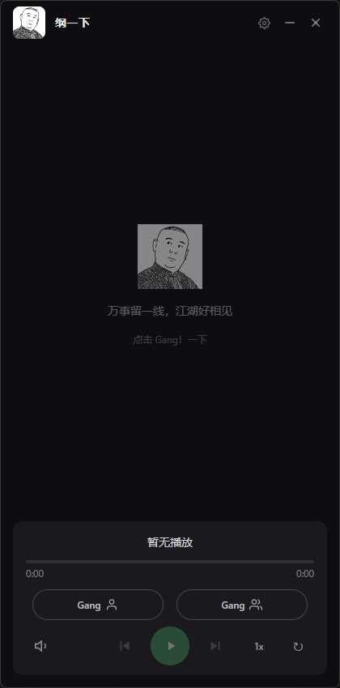
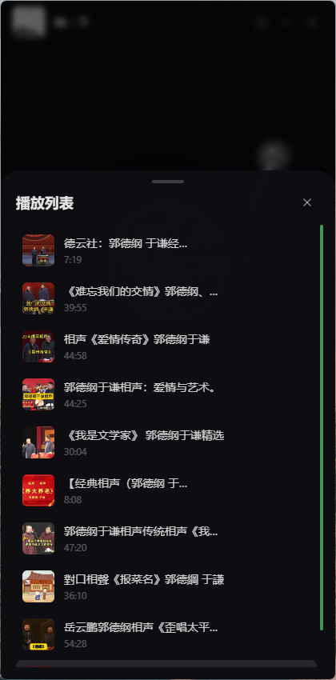

# 纲一下

一个优雅的桌面应用，用于随机播放郭德纲相声。支持单口和对口相声，让您随时随地享受经典相声作品。

## 📸 界面预览

<table>
<tr>
<td width="50%">

**主界面**



</td>
<td width="50%">

**播放列表**



</td>
</tr>
</table>

## ✨ 功能特性

### 🎵 核心功能
- **随机播放**：一键随机获取并播放郭德纲相声
- **单口/对口分类**：支持单独搜索单口相声或对口相声
- **播放列表管理**：自动管理播放列表，支持添加、删除、切换
- **多种播放模式**：顺序播放、列表循环、单曲循环、自动纲一下

### 🎛️ 播放控制
- **播放速度调节**：支持 0.5x - 2.0x 倍速播放
- **音量控制**：点击切换静音/取消静音，悬停显示音量条
- **进度控制**：支持拖拽进度条跳转
- **上一首/下一首**：快速切换曲目

### ❤️ 收藏功能
- **一键收藏**：点击心形图标收藏喜欢的相声
- **收藏管理**：在设置面板中查看和管理收藏列表
- **快速播放**：从收藏列表直接播放

### 💾 下载功能
- **音频下载**：支持下载音频文件到本地
- **下载进度**：实时显示下载进度
- **自定义路径**：可设置默认下载路径

### 🎨 界面特性
- **现代化 UI**：深色主题，简洁美观
- **音频可视化**：标题栏支持音频波形显示
- **托盘支持**：最小化到系统托盘
- **无边框窗口**：自定义标题栏

## 🛠️ 技术栈

- **前端框架**：React 18 + TypeScript
- **桌面框架**：Electron 28
- **构建工具**：Vite 5
- **状态管理**：Zustand
- **样式方案**：Tailwind CSS
- **HTTP 客户端**：Axios

## 📦 安装

### 环境要求
- Node.js >= 18
- pnpm (推荐) 或 npm

### 安装依赖
```bash
pnpm install
```

### 开发模式
```bash
pnpm dev
```

### 构建应用
```bash
pnpm build
```

构建完成后，安装包会在 `dist` 目录中。

## ⚙️ 设置

点击右上角设置图标打开设置面板：

- **关闭行为**：选择关闭窗口时退出程序或最小化到托盘
- **下载路径**：设置默认音频保存位置
- **收藏管理**：查看和管理收藏的相声

## 📝 项目结构

```
gang-yi-xia/
├── electron/              # Electron 主进程代码
│   ├── main.ts           # 主进程入口
│   └── preload.ts        # 预加载脚本
├── src/
│   ├── api/              # API 接口
│   │   ├── bilibili.ts   # B站 API 封装
│   │   └── request/      # 请求工具
│   ├── assets/           # 静态资源
│   │   ├── back.jpg      # 播放列表背景图
│   │   ├── icon.png      # 应用图标
│   │   └── guodegang.png # Logo
│   ├── components/       # React 组件
│   │   ├── AudioWaveform.tsx   # 音频波形可视化
│   │   ├── PlayerControls.tsx  # 播放控制
│   │   ├── Playlist.tsx        # 播放列表
│   │   ├── Settings.tsx        # 设置面板
│   │   ├── TitleBar.tsx        # 标题栏
│   │   └── Toast.tsx           # 提示消息
│   ├── store/            # 状态管理
│   │   ├── player.ts     # 播放器状态
│   │   ├── settings.ts   # 设置状态
│   │   └── favorites.ts  # 收藏状态
│   ├── App.tsx           # 应用入口
│   └── index.css         # 全局样式
├── package.json
└── vite.config.ts
```

## 🔧 开发

### 项目启动
```bash
# 安装依赖
pnpm install

# 启动开发服务器
pnpm dev

# 启动 Electron（需要先启动 dev）
pnpm electron:dev
```

### 代码规范
- 使用 TypeScript 进行类型检查
- 使用 ESLint 进行代码检查
- 遵循 React Hooks 最佳实践

## 📄 许可证

本项目仅供学习交流使用。

## 🙏 致谢

- 感谢 Bilibili 提供的 API 支持
- 感谢郭德纲老师带来的精彩相声作品

## 📮 反馈

如有问题或建议，欢迎提交 Issue 或 Pull Request。

---

**床前明月光，疑是地上霜，举头望明月，我叫郭德纲** 🌙

